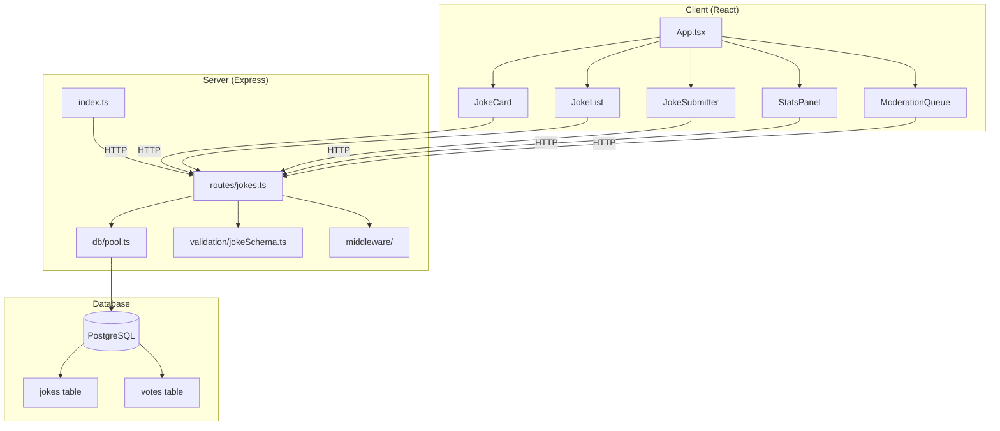
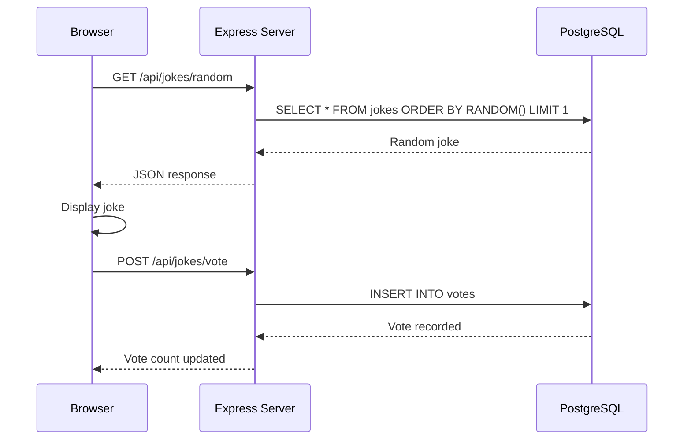
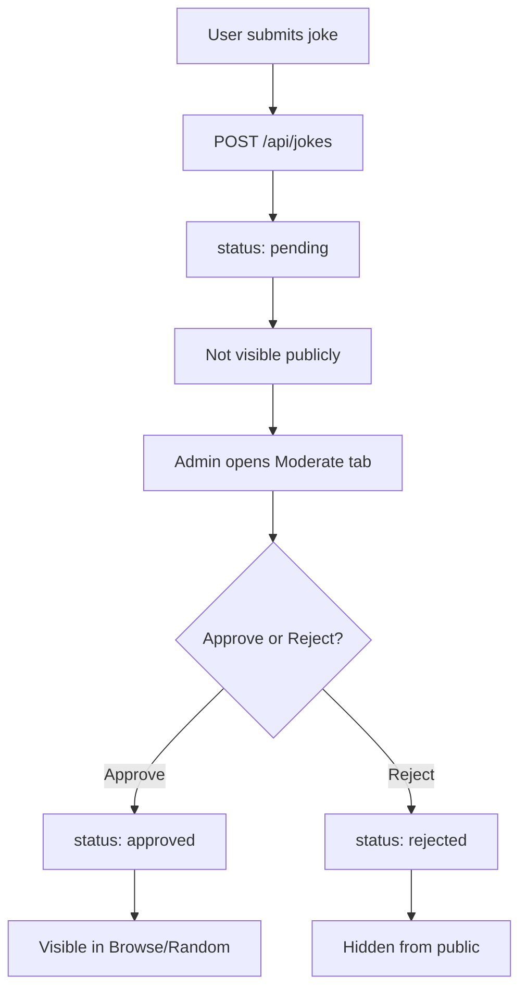

# landonkea-dad-jokes-api - Design & Workflow

## High-Level Overview

## API Request Flow

## Moderation Flow

## File Relationships

| File | Purpose | Used By |
|------|---------|---------|
| `server/src/index.ts` | Server entry | Node.js |
| `server/src/routes/jokes.ts` | API routes | Express |
| `server/src/db/pool.ts` | DB connection | Routes |
| `server/src/db/init.ts` | Create tables | `npm run db:init` |
| `server/src/db/seed.ts` | Seed jokes | `npm run db:seed` |
| `client/src/App.tsx` | Main UI | Vite |
| `client/src/hooks/useJokes.ts` | API calls | Components |
| `docker-compose.yml` | Container setup | Docker |

## draw.io

[Open in draw.io](https://app.diagrams.net/#RDad%20jokes%20architecture)
